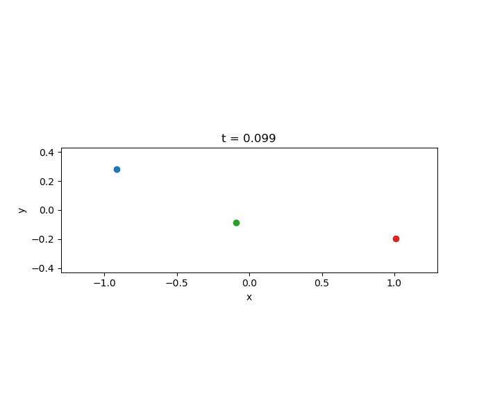
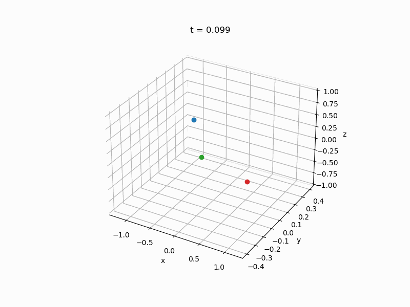

# 🪐 3D N-Body Simulation with Leapfrog Integration

This project simulates the motion of multiple particles under mutual gravitational attraction in three dimensions.  
It is implemented in **Fortran 90** using modular programming and produces an output file (`output.dat`) that can be visualized with a **Python animation script**.

---

## 📁 Project Structure

```
├── geometry.f90 # Module: defines 3D vectors/points and custom operators
├── particle.f90 # Module: defines particle type (mass, position, velocity)
├── ex1.f90 # Main program: leapfrog time integration (uses geometry and particle modules)
├── Makefile # Automates compilation of modules and main program
├── output.dat # Simulation results (generated after running ex1)
├── plot2D.py # 2D animation of the simulation results
├── plot3D.py # 3D animation of the simulation results
└── test.f90 # Auxiliary test program for geometry module
```

* `geometry.f90` and `particle.f90` are Fortran modules used by `ex1.f90`.
* `Makefile` compiles and links all .f90 files into an executable.
* Running the program generates `output.dat`, which is visualized using the Python scripts `plot2D.py` and `plot3D.py`.
* `test.f90` is an independent verification file used to test the geometry module (not required for compilation).

---

## ⚙️ Compilation

A `Makefile` is provided for automatic compilation.

```bash
make
```

This will produce the executable:
```nginx
ex1
```

To clean the directory (remove object and module files):

```bash
make clean
```

---

## ▶️ Running the Simulation

After compilation, the program can be executed either manually with:
```bash
./ex1
```

or, alternatively, using the `Makefile` shortcut command:
```bash
make test
```

When run, it will prompt:
```arduino
Insert name of the simulation setup file:
```
Enter the name of your input file (for example `input.dat`).

## 📥 Input File Format

The setup file must specify:

1. The number of particles.
2. Simulation parameters.
3. Initial conditions for each particle (mass, position, and velocity).

Expected structure:
```lua
dt
dt_out
t_end
n
m1 x1 y1 z1 vx1 vy1 vz1
m2 x2 y2 z2 vx2 vy2 vz2
...
```

Where:
* `dt` → integration time step
* `dt_out` → time interval between successive output records
*  `t_end` → total simulation time
* `n` → number of particles
* `m` → particle mass
* `(x, y, z)` → initial position
* `(vx, vy, vz)` → initial velocity

## 📤 Output File (`output.dat`)

After running the program, an output file named `output.dat` is generated.
It contains the positions of all particles at each saved time step.

Structure:
```nginx
t  x1 y1 z1  x2 y2 z2  ...  xN yN zN
```

Where:

* Each row corresponds to a simulation time step where data is recorded.
* The first column is time (t).
* The remaining columns are the positions (x, y, z) of each particle.

This file can be directly used by the animation Python scripts for visualization.

## 🎞️ Visualization

Use the provided Python scripts to create an animation of the particle trajectories. You can either create a 2D or 3D animation using `plot2D.py` or `plot3D.py`.

```bash
python plot2D.py
python plot3D.py
```

The scripts:

* Read `output.dat`
* Create a 2D or 3D animation of the particle trajectories
* Save the animation as `animation2D.gif` or `animation3D.gif`

After execution, you should see:
```css
Animation saved.
```

As an example, the 2D and 3D animations obtained with the provided input file are shown below:




## 🧠 Implementation Details

* Integration scheme: Leapfrog method
* Physics: Newton’s law of gravitation
* Precision: Double precision (`real64`)
* Modules:

    * `geometry.f90`: Defines `vector3d` and `point3d` types with custom operators.
    * `particle.f90`: Defines the `particle3d` type (mass, position, velocity).

* Output control: Positions are written to `output.dat` every `dt_out` interval.

## 👨‍💻 Author

Raquel Garcia Paris  
Programming Techniques - Course Exercise 1  
Universidad de La Laguna - 2025